# SalaFitness - Frontend

This is the interface for the gym management application!

### Install dependencies

This command will download all the necessary libraries (react, vite, etc) into the `node_modules` folder.
npm install

```bash
npm install
```

API Configuration
Target API URL: 
```bash
http://localhost:5001/api
```

Running the Application
To start the local development server and view the application in your browser:
```bash
npm run dev
```

### Application Gallery

Here is a visual overview of the platform, categorized by user roles and features.

#### General Views

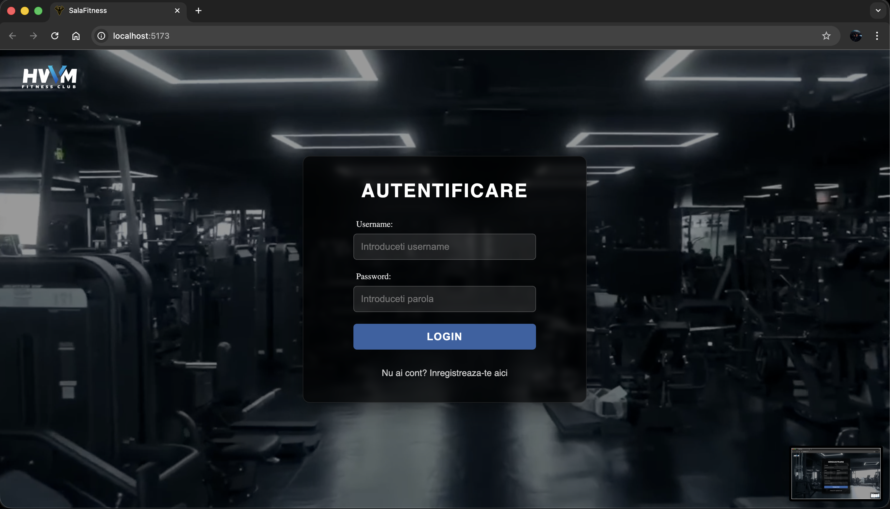
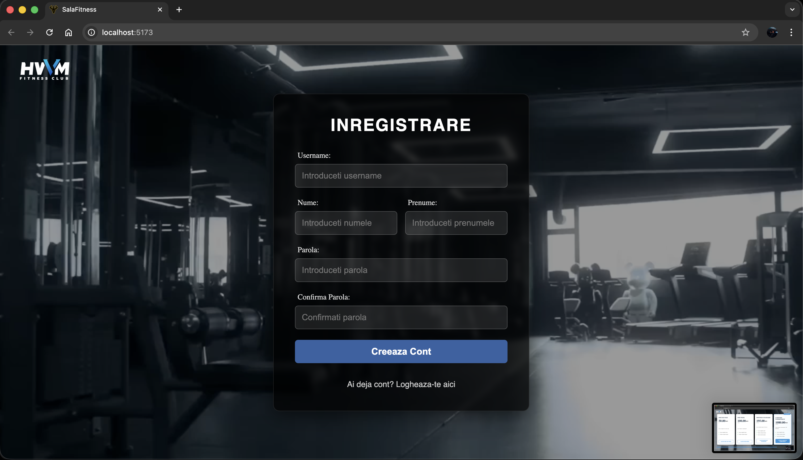
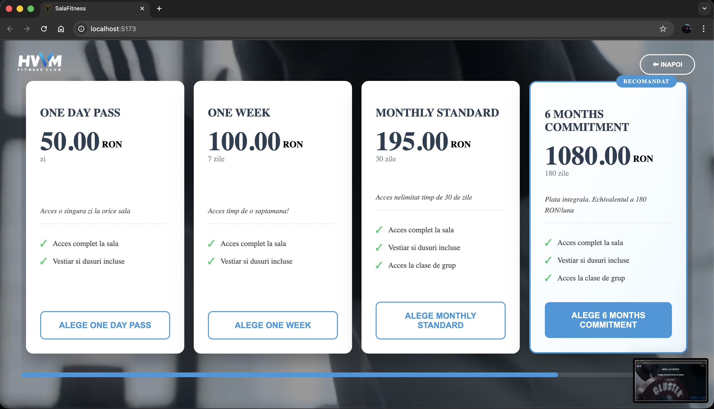

#### Client Interface

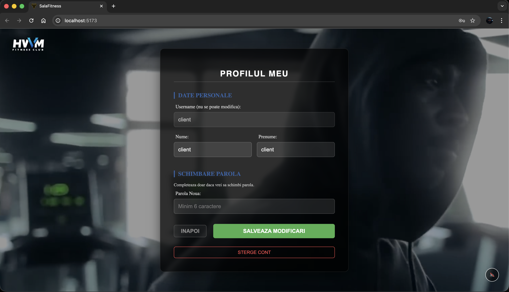
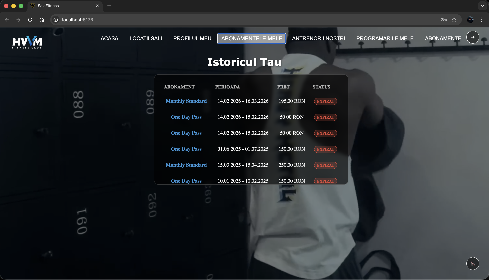
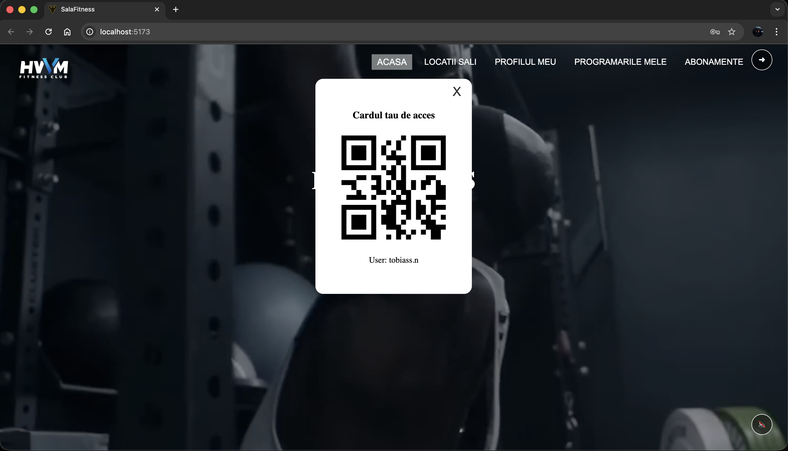

#### Bookings and Locations
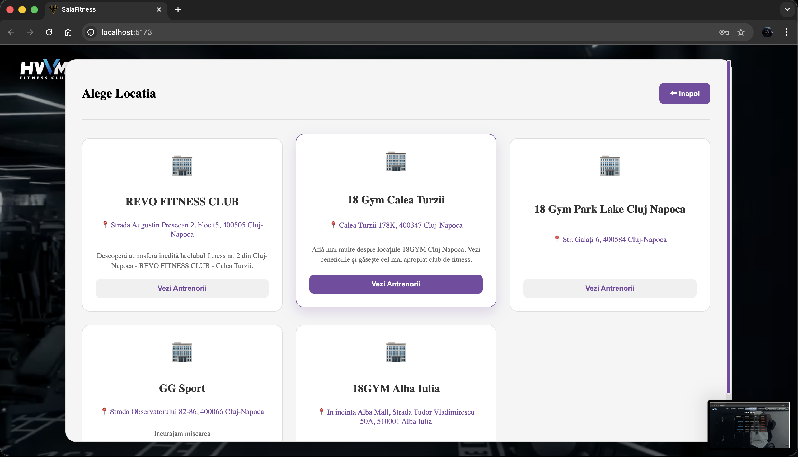
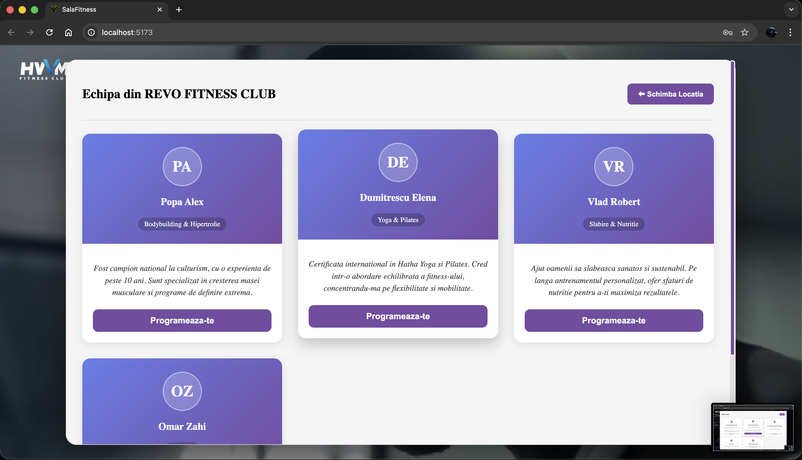
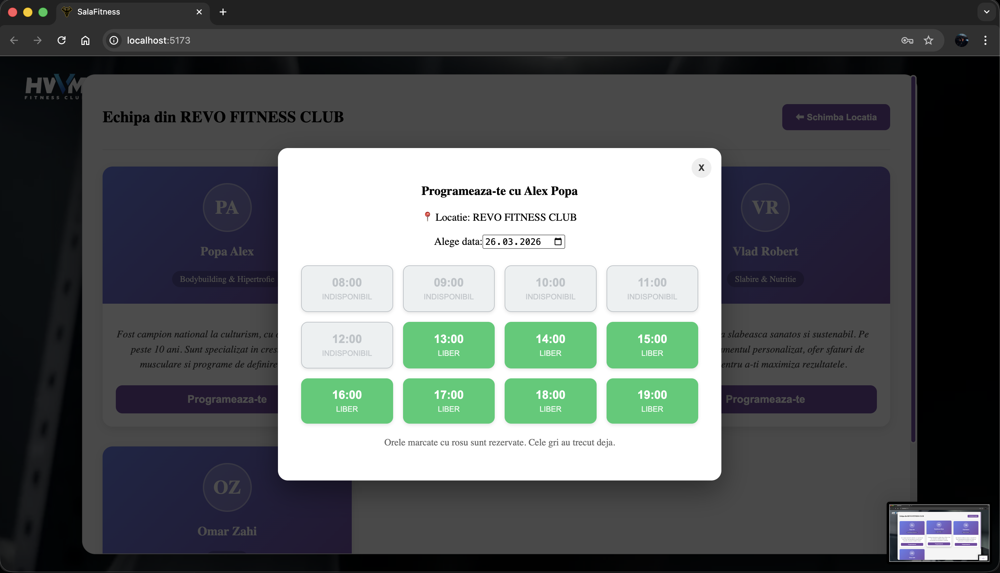
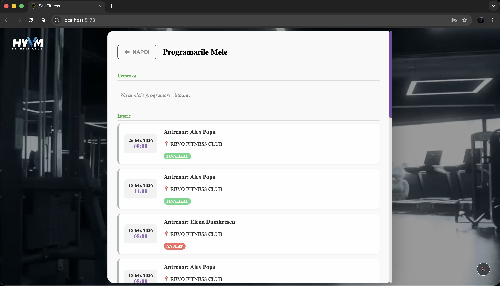
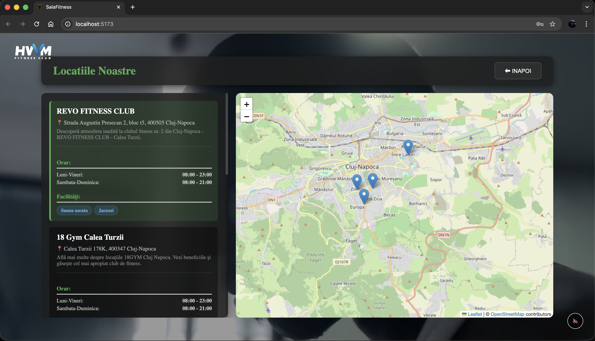
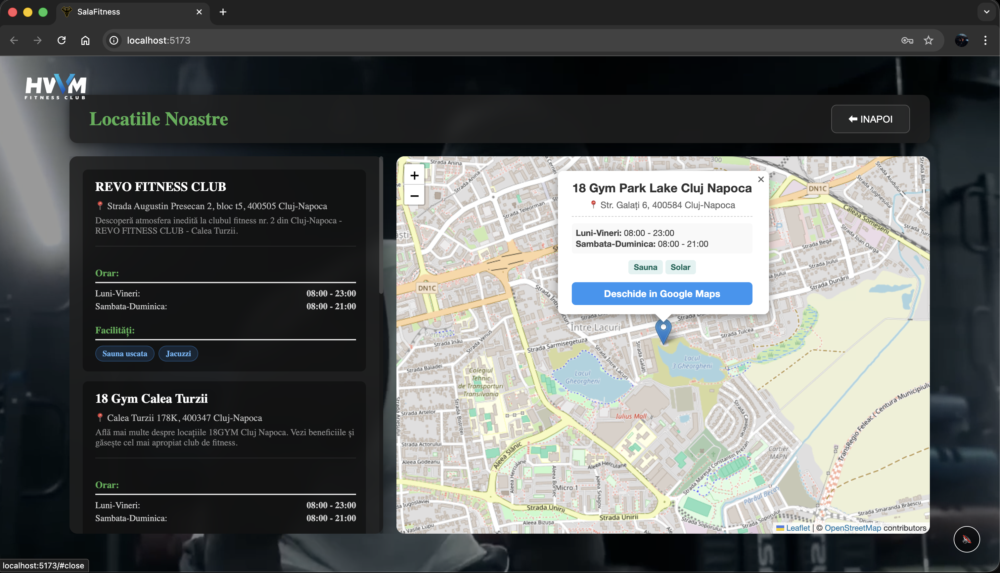

#### Trainer Interface

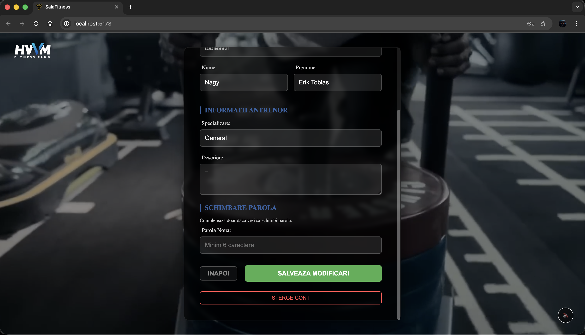

#### Admin Control Panel
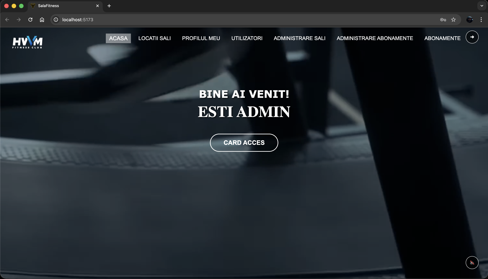
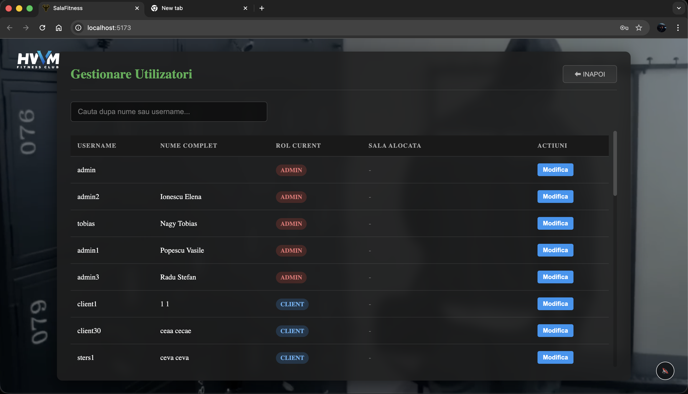
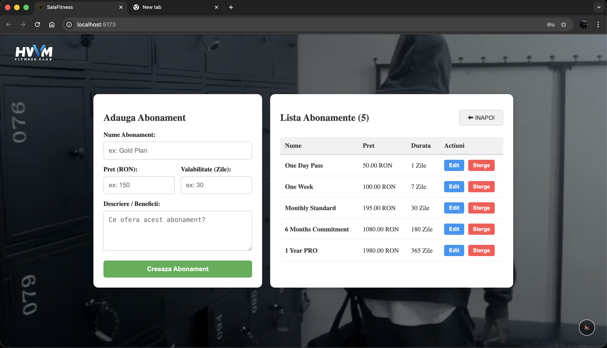
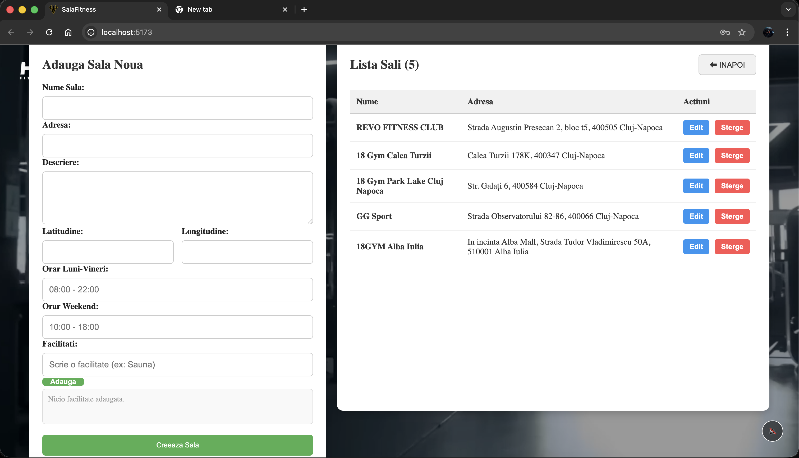

---